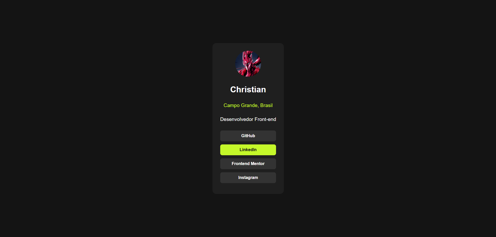

# 🌐 Card de Links Sociais (Social Links Profile)

Uma página de perfil com links sociais responsiva, moderna e acessível, construída com HTML5 semântico e CSS3 puro. 

Este projeto é uma solução para o desafio do [Frontend Mentor](https://www.frontendmentor.io/).

---

## 📸 Demonstração



---

## 🚀 Tecnologias Utilizadas

- **HTML5 Semântico** (`main`, `article`, `ul`, `a`)
- **CSS3** (Flexbox, Variáveis, Transitions e pseudo-classes)
- **Git & GitHub** (Controle de versão via SSH)

---

## 🎯 Conceitos e Aprendizados Aplicados

Durante o desenvolvimento deste projeto, foram praticadas e consolidadas as seguintes técnicas:

1. **Transformação de Links em Botões:**
   - Uso de `display: block` e `width: 100%` nas tags `<a>` para garantir que toda a área do botão seja clicável.
2. **Animações e Efeitos `:hover`:**
   - Aplicação da propriedade `transition` diretamente no elemento base para garantir suavidade tanto na entrada quanto na saída do ponteiro do mouse.
3. **Boas Práticas de Segurança e Acessibilidade:**
   - Uso de `target="_blank"` acompanhado de `rel="noopener noreferrer"` para proteger a aplicação ao abrir links externos.
   - Utilização de HTML semântico para melhorar a acessibilidade e o SEO.

---

## 🛠️ Como Executar o Projeto

1. Clone este repositório usando SSH:
   ```bash
   git clone git@github.com:ChristianProgramador/NOME-DO-SEU-REPOSITORIO.git